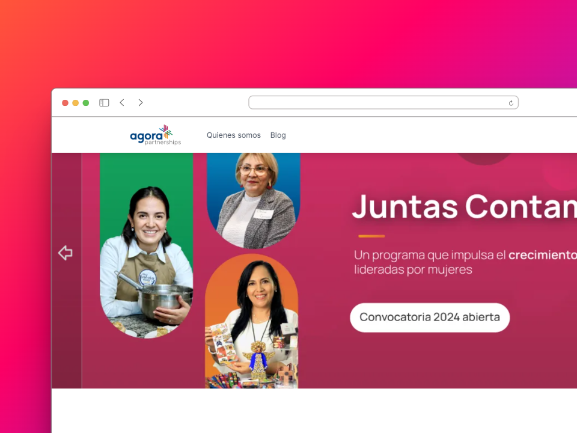

# 🌎 Proyecto Agora 2030

Proyecto de desarrollo de una pagina web para la empresa Agora2030 con el fin de mejorar la experiencia de usuario y la presentación de la empresa.

Link de la pagina web: [Argo page](https://adiazt01.github.io/argo-webpage/)



## ⚙ Tecnologías usadas

- [React JS](https://reactjs.org/): Es una biblioteca de JavaScript para construir interfaces de usuario.
- [TypeScript](https://www.typescriptlang.org/): Es un lenguaje de programación de código abierto desarrollado y mantenido por Microsoft.
- [Vite](https://vitejs.dev/): Es un compilador de front-end que proporciona una experiencia de desarrollo de aplicaciones web extremadamente rápida.
- [Tailwind CSS](https://tailwindcss.com/): Es un marco de diseño CSS de utilidad de bajo nivel para crear rápidamente diseños personalizados.

## 📦 Paquetes de terceros empleadas

- [react-router-dom](https://www.npmjs.com/package/react-router-dom): Es una colección de enlaces de navegación y componentes de navegación para sitios web. Permiten la navegación declarativa y basada en componentes en aplicaciones React. Es decir que permite la navegación entre diferentes componentes de la aplicación.
- [lucide-icons](https://www.npmjs.com/package/lucide): Es una librería de iconos que se pueden utilizar en la aplicación.
- [react-hook-form](https://www.npmjs.com/package/react-hook-form): Es una librería que permite la validación de formularios y manejo de estados de los mismos. Es de fácil uso y muy eficiente ademas permite la integración con librerias de validación como Yup o Zod.
- [emailjs-com](https://www.npmjs.com/package/emailjs-com): Es una librería que permite el envió de correos electrónicos desde la aplicación. Es muy fácil de usar y permite el envió de correos desde el cliente sin necesidad de un servidor de correo. Adjunto el correo para testear dicho formulario:
  - Email: testuseragorra@gmail.com
  - Password: Agora123

## 🌌 Buenas practicas de desarrollo aplicadas

- ✅ Cada sección del sitio web se encuentra en un componente independiente para facilitar la reutilización de los mismos.
- ✅ La lógica y manejo del estado se encuentra en los custom hooks para facilitar la reutilización de la lógica. Permitiendo separar las responsabilidades de los componentes, es decir se siguió el patron SRP (Single Responsibility Principle).
- ✅ El desarrollo de la pagina web se hizo principalmente con desarrollo Movil First, es decir se desarrollo primero para dispositivos móviles y luego se adapto a dispositivos de escritorio. Permitiendo una mejor experiencia de usuario en dispositivos móviles asi como en dispositivos de escritorio.
- ✅ La estructura de carpetas se realizo de forma ordenada y clara para facilitar la lectura y mantenimiento del código.

```bash
.
├── .env
├── .eslintrc.cjs
├── .github
│   └── workflows
├── .gitignore
├── .prettierrc
├── public
├── src
│   ├── assets
│   │   ├── backgrounds
│   │   ├── fonts
│   │   ├── hero
│   │   └── logo
│   ├── components
│   │   ├── badge
│   │   ├── button
│   │   └── cards
│   ├── context
│   ├── helpers
│   ├── hooks
│   ├── layout
│   ├── mock
│   ├── pages
│   ├── sections
│   ├── services
│   ├── style
│   └── types
```

## 📈 Sugerencias aplicadas

- 📱 **Diseño Responsivo**: La página web es completamente responsiva y se adapta a cualquier tamaño de pantalla.
- 🎨 **Animaciones sutiles**: Se han añadido animaciones sutiles a lo largo de la página para mejorar la experiencia de usuario.
- 👓 **Accesibilidad**: Se ajustaron algunos contrastes del sitio web permitiendo mayor legibilidad y fluidez en el. Sin embargo la opción de estilos para cada caso no pudo ser agregada a tiempo.
- 👟 **Optimización**: Se comprimieron y convirtieron la mayoría de las imágenes al formato `webp` permitiendo mayor rendimiento y menos uso de recursos para el uso de estas. Ademas de mejorar la accesibilidad de las etiquetas `HTML`.
- 🧪 **Test de integración y unitarios** : Se realizaron pruebas unitarias y de integración para garantizar el correcto funcionamiento de la aplicación. Garantizando la fiabilidad del código. La pagina de la landing posee tanto test de integración como unitarios.

## 🚀 Consideraciones de la prueba ademas de mejoras

### 💀 Dificultades tecnicas

- 📦 **REST API FALLIDA**: La petición de la API REST puede fallar debido a la capa gratuita de la API, por ello se implemento un mock de la API para poder mostrar los datos en la pagina web. Ademas se implemento un mensaje de error en caso de que la API falle.

  ```javascript
   useEffect(() => {
    const fetchData = async () => {
      try {
        const apiPosts = await fetchBlogPosts();
        const posts: Post[] = apiPosts.map(adaptPost);
        console.log(posts);
        setPosts(posts);
        setLoading(false);
      } catch (error) {
        if (error instanceof Error) {
          const posts: Post[] = dataset.results.map(adaptPost);
          setPosts(posts);
          setError(error);
          setLoading(false);
        }
      }
    };

    void fetchData();
  }, []);
  ```

### 📈 Mejoras

- La sección del header se puede mejorar para hacer algún tipo de diseño que no dependa del formato o de la calidad de la imagen, Permitiendo una mejor experiencia de usuario en distintas pantallas y resoluciones.

## 👥 Reconocimiento a los Recursos Empleados

- 🌐 **[API REST](https://newsdata.io/)**: La API que se uso para la solicitud de los artículos fue obtenido de News Data.

- 📷 **[Imágenes](https://unsplash.com)**: Gracias a la pagina web Unsplash y Freepik se extrayeron las siguientes fotografías:

  - **🖼 [Imagen 404 de storyset](https://www.freepik.com/free-vector/oops-404-error-with-broken-robot-concept-illustration_13315300.htm#query=404%20page%20found&position=3&from_view=keyword&track=ais&uuid=4d518585-71c1-43e5-b0b1-0b9753d3231b)**

  - **🖼[Imagen de tonodiaz en Freepik](https://www.freepik.es/foto-gratis/tengo-negocio-crecimiento-retrato-bella-empresaria-sonriendo-haciendo-contacto-visual-mientras-prepara-paquetes-listos-enviar-clientes_27999290.htm#query=emprendedor&position=2&from_view=keyword&track=sph&uuid=12bbbd49-7d3a-4382-9277-f10154892fce)**

  - **🖼 [Imagen de tirachardz en Freepik](https://www.freepik.es/foto-gratis/hombres-negocios-asiaticos-mujeres-negocios-que-reunen-intercambiar-ideas-sobre-aplicacion-planificacion-diseno-web-creativo-desarrollar-diseno-plantilla-proyectos-telefonos-moviles-que-trabajan-juntos-oficina-pequena_10075056.htm#fromView=search&page=1&position=30&uuid=2e8d5629-c8df-4c74-883c-a55e22e7e40f)**

  - **🖼 [Imagen de freepik](https://www.freepik.es/foto-gratis/mujer-segura-invernadero_1957110.htm#fromView=search&page=1&position=1&uuid=90631e0c-506c-4cc1-8b24-75745a6909dd)**

- 🎨 **[Iconos](https://lucide.netlify.app/)**: Los iconos que se usaron en la pagina web fueron obtenidos de Lucide Icons.

- 🎨 **[Fuentes](https://fonts.google.com/)**: Las fuentes que se usaron en la pagina web fueron obtenidas de Google Fonts.

- 🎁 **[Logos](https://agora2030.org/)**: Los iconos fueron extraídos desde la propia web principal de [Agora2030](https://agora2030.org/)

## 👩‍💻 Enlaces para mas información de la prueba

- Link to the test: [https://vite-react-ts.vercel.app/](https://gist.github.com/fabianmedina09/73a7e4fa45f133aff2baedb25f174b0e)

- Project Manager: [https://www.linkedin.com/in/roberto-rodriguez-8a7012224/](https://www.linkedin.com/in/roberto-rodriguez-8a7012224/)

- Page to replicate: [agora2030](https://agora2030.org/)
